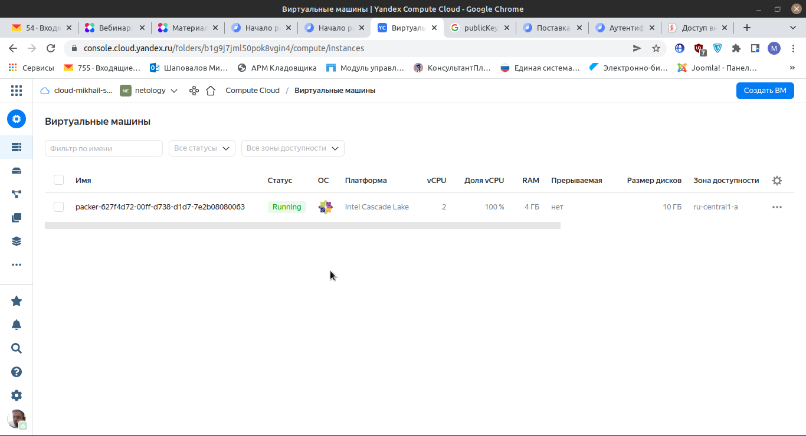
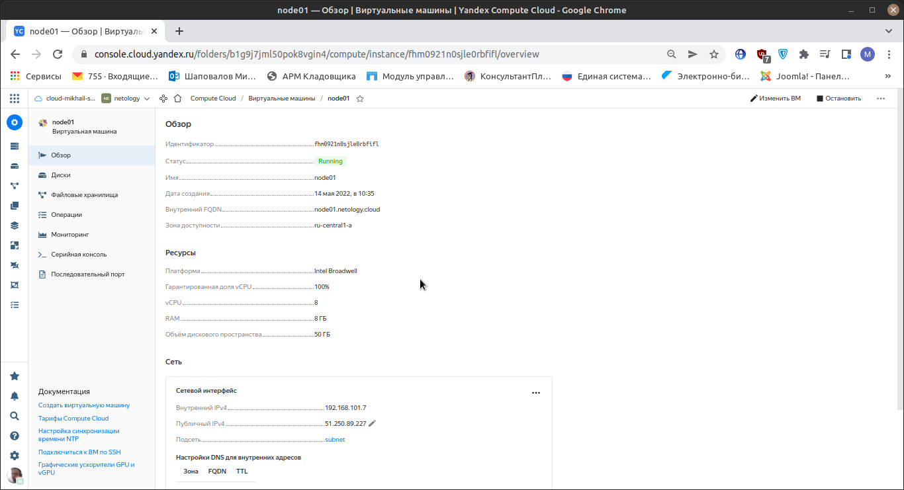
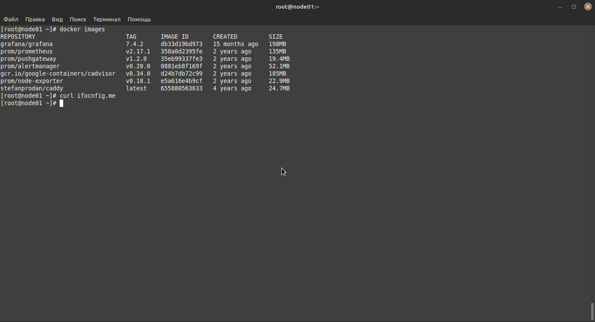
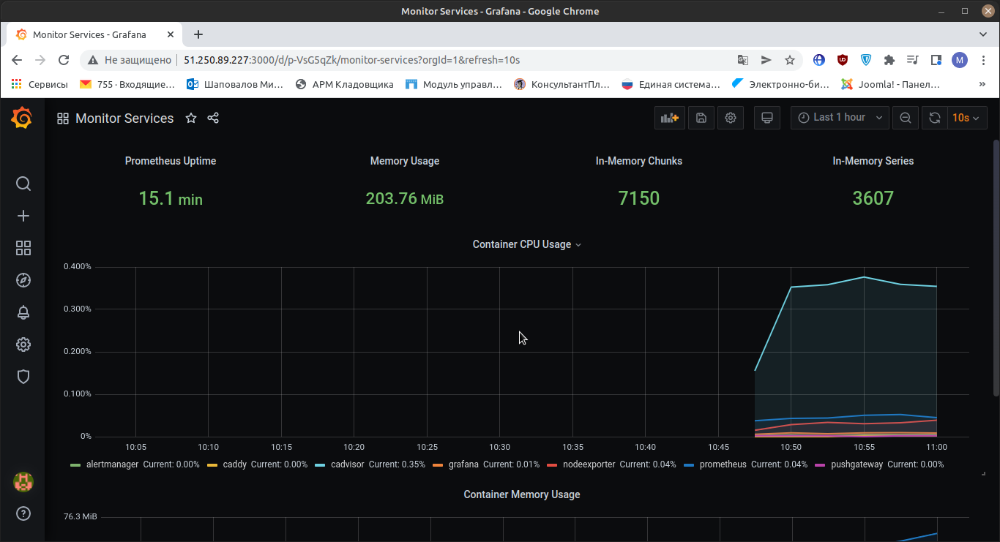
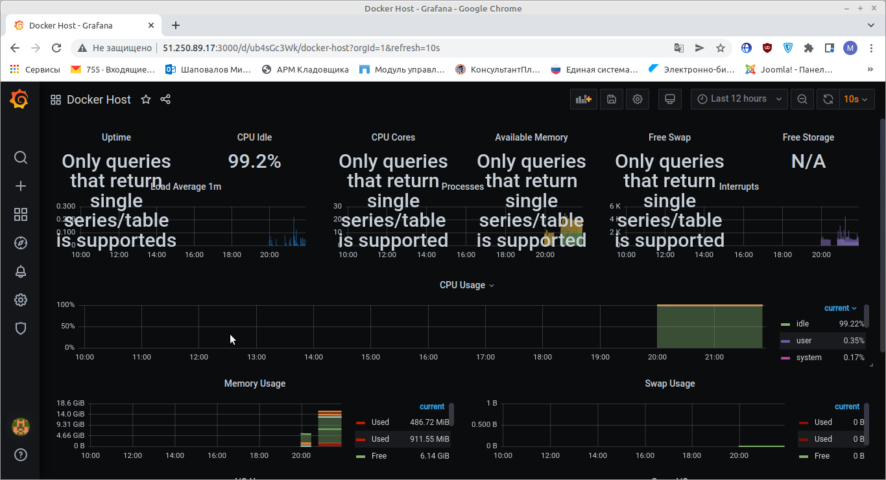

# 5.4
## 1.
Создамим сеть 
Создайте облачную сеть с именем и описанием в выбранном каталоге:

        yc vpc network create --name test-network-1 \
        --labels my-label=netology \
        --description "My test network" \
        --folder-id b1g9j7jml50pok8vgin4

Создадим подсеть

        yc vpc subnet create --name test-subnet-1 \
        --description "My test subnet" \
        --folder-id b1g9j7jml50pok8vgin4 \
        --network-id enp0beedldsfvtmhd8ri \
        --zone ru-central1-a \
        --range 10.1.2.0/24
Далее запускаем packer

         packer validate centos-7-base.json

         packer build centos-7-base.json

проверяем
        yc compute image list

                mikhail@Lenovo-B560:~/L/yc/packer$ yc compute image list
                +----------------------+---------------+--------+----------------------+--------+
                |          ID          |     NAME      | FAMILY |     PRODUCT IDS      | STATUS |
                +----------------------+---------------+--------+----------------------+--------+
                | fd826vnhmp64fvcaeqn4 | centos-7-base | centos | f2esd9f5o5i9p7pkkk8k | READY  |
                +----------------------+---------------+--------+----------------------+--------+
Проверка Рисунок № 1

Далее необходимо создать key.json

yc iam key create --service-account-id id-service-ak --output key.json

                yc iam key create --service-account-id ajegd4t1136rgem1tt6h --output key.json
                id: ajeiep5lfqet969htrl9
                service_account_id: ajegd4t1136rgem1tt6h
                created_at: "2022-05-14T06:55:34.511149473Z"
                key_algorithm: RSA_2048

                cat key.json
                {
                "id": "ajeiep5lfqet969htrl9",
                "service_account_id": "ajegd4t1136rgem1tt6h",
                "created_at": "2022-05-14T06:55:34.511149473Z",
                "key_algorithm": "RSA_2048",
                "public_key": "-----BEGIN PUBLIC KEY-

Необходимые данные для дальнейшей работы

                yc config list

удаляем сети и подсети ранее созданые

                yc vpc subnet delete --name test-subnet-1 && yc vpc network  delete --name test-network-1

Запускаем создание виртуальной машины

                terraform apply -auto-approve

Проверка выполнения правильности развертывания виртуальной машины в яндекс облаке 

Рисунок № 2

Запуск Ansible
Необходимо поправить только inventory, прописать IP адреса.

                ansible-playbook provision.yml
После этого проверяем работу, подключаемся по SSH на сервер и запускаем

                docker image,
 в результате получаем список всех контейнеров, которые развернулись после работы Ansible. 
 
 Проверка на скрине рисунок № 3
 

Далее можно пройти по IP адресу сервера на порт 3000 и попасть в веб консоль Grafana.

Рисунок № 4

И наблюдаем, что данные по состоянию контейнеров  стали поступать. Значит, настройки и развертывания прошли успешно. 

Далее я пытался выполнить доп задание, надеюсь на Вашу помощь. Создал сервер с 2 виртуальными машинами. Проверил доступность на 2 вирт машине prometheus и cadvisor
Получил их метрики, добавил на сновной машине в файл конфигурационный prometheus 

                - job_name: 'nodeexporter_e'
                scrape_interval: 5s
                static_configs:
                - targets: ['192.168.101.7:9100']
и

                - job_name: 'cadvisor_e'
                scrape_interval: 5s
                static_configs:
                - targets: ['192.168.101.7:8080']

Так же в docker-compose.yml добавил под каждым койтенером порт 

                expose:
                - 9100 (это пример одного из)
В итоге данные со второй вирт машины о состояние контейнеров не поступают не поступают. Прошу поделится знаниями и сайтами, где я могу глубже разобраться в данной проблеме.
