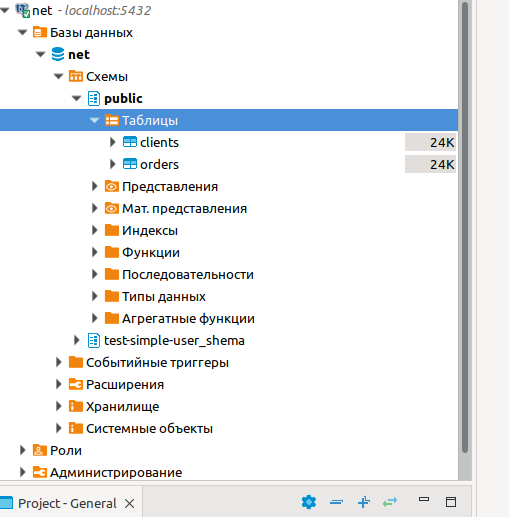

# "6.2. SQL"

## 1.
Создаем docker-compose.yml

        cat docker-compose.yml 
        version: "3.3"
        services: 
                db:
                image: postgres:12
                restart: always
                hostname: postgres12    
                container_name: db_post
                environment:
                        POSTGRES_DB: "test"
                        POSTGRES_USER: "test"
                        POSTGRES_PASSWORD: "test"
                        PGDATA: /var/lib/postgresql/data/pgdata          
                volumes:
                        - data:/var/lib/postgresql/data:rw
                        - bkp:/var/lib/postgresql/
                ports:
                        - 5432:5432
        volumes:
                data:
                bkp:
                                                                                              
## 2.
создаем БД и назначаем владельца этой БД

        CREATE DATABASE "test_db" OWNER "test-admin-user"

Создаём владельца данной БД и присваевыаем ему пароль

        create user "test-admin-user" with password 'pass1'
Теперь создаем таблицу orders

        create table orders
        (
            id int not null primary key
            , name CHAR(20)
            , chena int
        )
Далее создвём таблицу clients

        create table clients
        (
            id int  not null primary key
            , FirstName CHAR(20)
            , Land CHAR(20)
            , zakaz integer REFERENCES orders (id)
        )
Создаем пользователя  test-simple-user

        create user "test-simple-user" with password 'pass2'
Создаем схему для данного пользователя и назначаем ему права SELECT/INSERT/UPDATE/DELETE

        CREATE SCHEMA "test-simple-user_shema" AUTHORIZATION "test-simple-user";me, пре
        GRANT SELECT, INSERT, UPDATE, DELETE ON ALL TABLES IN SCHEMA "test-simple-user_shema"  TO "test-simple-user";
## 3.
Заполняем таблицу orders

        insert into orders values
            (1,'Шоколад', 10)
            ,(2,'Принтер', 3000)
            ,(3, 'Книга', 500)
            ,(4, 'Монитор', 7000)
            ,(5, 'Гитара', 4000)
проверяем     

        select * from orders
    1	Шоколад             	10
    2	Принтер             	3000
    3	Книга               	500
    4	Монитор             	7000
    5	Гитара              	4000

Заполняем таблицу clients

        insert into clients values
            (1, 'Иванов Иван Иванович','USA' )
            ,(2, 'Петров Петр Петрович', 'Canada' )
            ,(3, 'Иоганн Себастьян Бах', 'Japan' )
            ,(4, 'Ронни Джеймс Дио', 'Russia' )
            ,(5, 'Ritchie Blackmore', '	Russia')
проверяем

        select * from clients 

    1	Иванов Иван Иванович	USA                 	
    2	Петров Петр Петрович	Canada              	
    3	Иоганн Себастьян Бах	Japan               	
    4	Ронни Джеймс Дио    	Russia              	
    5	Ritchie Blackmore   	Russia	

Кол-во записей в таблицах вычисляется скриптом

        SELECT COUNT(id) FROM clients
5
Аналогично 5

        SELECT COUNT(id) from orders

## 4.
выполняем запросы по очереди

        update clients set  zakaz = (select id from orders  where name = 'Книга') where firstname = 'Иванов Иван Иванович'

        update clients set  zakaz = (select id from orders  where name = 'Монитор') where firstname = 'Петров Петр Петрович'

        update clients set  zakaz = (select id from orders  where name = 'Гитара') where firstname = 'Иоганн Себастьян Бах'

В итоге получаем

        4	Ронни Джеймс Дио    	Russia              	
        5	Ritchie Blackmore   	Russia 	
        1	Иванов Иван Иванович	USA                 	3
        2	Петров Петр Петрович	Canada              	4
        3	Иоганн Себастьян Бах	Japan               	5
Сверяем, всё ок.
Для вывода всех, у кого поле zakaz не пустое

        select * from clients where zakaz<>'0'
        select * from clients where zakaz is not null

## 5.

        EXPLAIN SELECT * from clients  where  zakaz is not null
        Seq Scan on clients  (cost=0.00..14.00 rows=398 width=176)
        Filter: (zakaz IS NOT NULL)
Узел плана проверяет это условие для каждого просканированного им узла и выводит только те строки, которые удовлетворяют ему. Предложение WHERE повлияло на оценку числа выходных строк. Значение rows даёт только приблизительное значени. Каждый раз оно не значительно меняется. 

        test_db=# EXPLAIN SELECT clients.person, orders.product
        FROM clients
        LEFT JOIN orders ON clients.order_id = orders.id
        WHERE zakaz IS NOT NULL;
                                      QUERY PLAN                               
        -----------------------------------------------------------------------
         Hash Join  (cost=15.61..28.65 rows=239 width=420)
           Hash Cond: (clients.order_id = orders.id)
           ->  Seq Scan on clients  (cost=0.00..12.40 rows=240 width=150)
           ->  Hash  (cost=12.50..12.50 rows=249 width=278)
                 ->  Seq Scan on orders  (cost=0.00..12.50 rows=249 width=278)
                       Filter: (id IS NOT NULL)
        (6 rows)
cost 15.61 - затраты на получение первой записи; 28.65 - затраты на получение всех записей; rows = 239 - приблизительное количество возвращаемых записей при выполнении операци; width=420 - средний размер одной записи в байтах
## 6.
Останавливаем контейнер и создаём новый контейнер, с новой бд и новым именем.

        docker run -it --name net -p 5432:5432 -e POSTGRES_USER=net -e POSTGRES_PASSWORD=net -e POSTGRES_DB=net -d -v 62_sql_bkp:/var/lib/postgresql/  postgres:12     
Создали отдельный контейнер, с новой бд и новыми пользователя.            
Далее подколючаемся к этому контейнеру

                docker exec  -it net bash   
Далее проверил наличие дампа памяти из тоё бд и выполнил команду

        psql -U net net < /var/lib/postgresql/test_db.dump
        SET
        SET
        SET
        SET
        SET
        set_config 
        ------------
        
        (1 row)

        SET
        SET
        SET
        SET
        CREATE SCHEMA
        ERROR:  role "test-simple-user" does not exist
        SET
        SET
        CREATE TABLE
        ERROR:  role "test-admin-user" does not exist
        CREATE TABLE
        ERROR:  role "test-admin-user" does not exist
        COPY 5
        COPY 5
        ALTER TABLE
        ALTER TABLE
        ALTER TABLE

Далее проверяем

